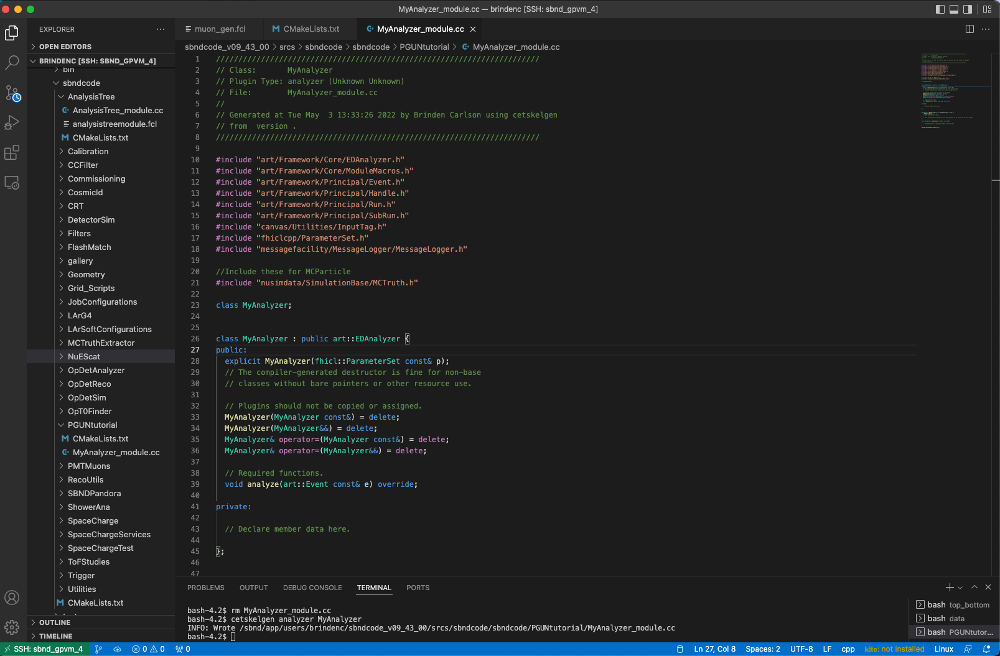
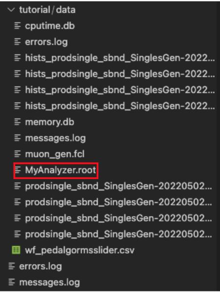
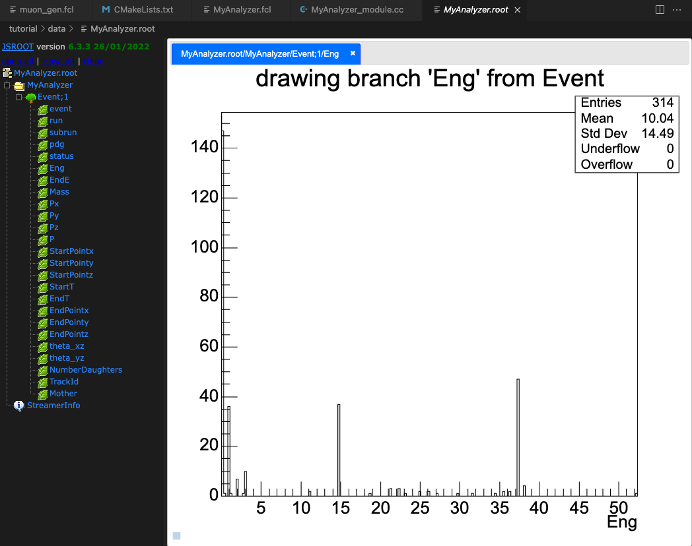

# Viewing charged particles in SBND using a particle gun generator and analyzer module

(Requires some knowledge of reconstruction chains, `c++`, `python` and a recent version of `sbndcode`. I ran on v09\_43_00)<br/><br/>If you still need to setup your `sbndcode` area, follow steps 1-3 on the [SBND Commissioning Page - Get Started Guide](https://sbnsoftware.github.io/sbndcode_wiki/commissioning/SBND_Commissioning_Get_Started.html)

1 - Visual Studio Code
----------------------
Although there are many text editor options, I'd recommend [Visual Studio Code](https://code.visualstudio.com/) for many reasons: <br/><br/>
1. It has syntax highlighting for almost every language including `Fermilab Hierarchical Configuration Language` or `.fcl` files.<br/>
2. You can view `.root` files using the `Explorer` page.<br/>
3. It supports `ssh` connections with `X11 forwarding`.<br/>
4. There are many keyboard shortcuts such as multiline commenting and search and replace. <br/>

To get started, let's first [add an ssh host on VSCode](https://code.visualstudio.com/docs/remote/ssh). Whichever `gpvm` machine you use should be fine. Next, we should [add extensions](https://code.visualstudio.com/docs/editor/extension-marketplace). For this tutorial, you'll need the following extensions: <br/><br/>
-[Fermilab Hierarchical Configuration Language support](https://marketplace.visualstudio.com/items?itemName=robertosoleti.fcl)<br/>
-[Python](https://marketplace.visualstudio.com/items?itemName=ms-python.python) and if you use [Jupyter Notebooks](https://marketplace.visualstudio.com/items?itemName=ms-toolsai.jupyter)<br/> 
-[C/C++](https://marketplace.visualstudio.com/items?itemName=ms-vscode.cpptools) <br/>
-[Root File Viewer](https://marketplace.visualstudio.com/items?itemName=albertopdrf.root-file-viewer) <br/><br/>
Now we can get started on doing physics in SBND! First, open the terminal in VSCode to make a directory and your `.fcl` file:
```
mkdir /sbnd/app/users/$USER/tutorial
mkdir /sbnd/app/users/$USER/tutorial/data 
cd /sbnd/app/users/$USER/tutorial/data
touch muon_gun.fcl
```
We will edit this `.fcl` file in the next section. 

2 - Particle Gun
-----------------------------------------------------------------------------
Using a particle gun is a simple way to simulate a single particle, or multiple particles at a time in the SBND detector (This can be done in ICARUS as well but I've done it here in SBND). Let's look at a particle gun `.fcl` file and see what's going on! Add the following lines to the file `muon_gun.fcl`

```bash
#include "prodsingle_sbnd_proj.fcl" #Include .fcl for producing particles

physics.producers.generator.PadOutVectors: true  #Duplicates single element vectors to match length of longest vector
physics.producers.generator.PDG: [13]            #Generate 1 muon
physics.producers.generator.P0: [3]              #p = 3 GeV/c 
physics.producers.generator.SigmaP: [0]          #No variance
physics.producers.generator.SigmaX: [0]          #
physics.producers.generator.SigmaY: [0]          #    
physics.producers.generator.SigmaZ: [0]          #    
physics.producers.generator.PosDist: 0           #0:Uniform 1:Gaussian         
physics.producers.generator.X0: [-150]           #Start track in TPC0 (x<0)
physics.producers.generator.Y0: [-100]           #Start in lower half of detector
physics.producers.generator.Z0: [-50]            #Start 50 cm upstream
physics.producers.generator.Theta0XZ: [25]       #Muon trajectory in X-Z plane
physics.producers.generator.Theta0YZ: [30]       #Muon trajectory in Y-Z plane
physics.producers.generator.SigmaThetaXZ: [0]    #No variance
physics.producers.generator.SigmaThetaYZ: [0]    #
physics.producers.generator.AngleDist: 0         #0:Uniform 1:Gaussian
```
(More information on all the settable parameters can be found [here](https://cdcvs.fnal.gov/redmine/projects/larsoft/wiki/EventGenerator#SingleGen.))
</br></br>To get started using this particle gun, copy the above lines into `muon_gun.fcl`, save the file, and run the following lines in the command line.
```bash
lar -c muon_gun.fcl -n 10 #Generates 10 particles
lar -c standard_g4_sbnd.fcl -s prodsingle_sbnd_SinglesGen-*.root #Runs GEANT4
lar -c standard_detsim_sbnd.fcl -s prodsingle_sbnd_SinglesGen-*_G4-*.root #Runs detector simulation
```
The output file is an `ART` file containing `LArSoft` data products. We can see exactly what data products are in this file by executing
```bash
lar -c eventdump.fcl prodsingle_sbnd_SinglesGen-*_G4-*_DetSim-*.root -n 1
```
We will be looking primarily at `MCParticle` data products for this tutorial, and we can check that our `DetSim` file has them by executing
```bash
lar -c eventdump.fcl prodsingle_sbnd_SinglesGen-*_G4-*_DetSim-*.root -n 1 | grep MCParticle
```
where the output shows a `vector` with the [simb::MCParticle](https://nusoft.fnal.gov/larsoft/doxsvn/html/classsimb_1_1MCParticle.html) class. We will be using this class to get the `G4` level information about our muons. First, however, we want to see what our detector sees using the [TITUS Event Display](https://sbnsoftware.github.io/sbndcode_wiki/TITUS_Event_Display.html)

3 - TITUS Event Display
-----------------------------------------------------------------------------

To view our event in `TITUS`, we should first setup the display by opening a fresh terminal, logging into a `gpvm` machine, and executing `source /sbnd/app/users/mdeltutt/static_evd/setup.sh`. To open the event display for our muon gun, run `evd.py -s /sbnd/app/users/$USER/tutorial/data/prodsingle_sbnd_SinglesGen-*_G4-*_DetSim-*.root`. When it opens, select `Raw Digit` on the right pane, wait a few seconds, and VOILÀ! You are now seeing what SBND sees when a muon passes through the detector! Clicking `next` in the top left pane allows you to see all the other muon events and they should all look the same!

4 - Analyzer Module
-----------------------------------------------------------------------------
The [SBND Commissioning Page - Get Started Guide](https://sbnsoftware.github.io/sbndcode_wiki/commissioning/SBND_Commissioning_Get_Started.html) covers the `hitdumper module`, which stores most relevant [detector information](https://github.com/SBNSoftware/sbndcode/blob/develop/sbndcode/Commissioning/HitDumper_module.cc#L152) such as hit and crt readouts. Our focus will be the truth level information, and how to write a simple analyzer module. First, make sure you have setup the `LArSoft` code space, then execute the following

```bash
cd $MRB_SOURCE/sbndcode/sbndcode
mkdir PGUNtutorial
cd PGUNtutorial
cetskelgen analyzer MyAnalyzer
```
`cetskelgen` produces a skeleton of a module with the class name being `MyAnalyzer`. The `analyzer` after `cetskelgen` specifies the type of `art` module being used, namely an `analyzer module`. There are also `producer` and `filter` modules which won't be covered here, but you can familiarize yourself with them [here](https://indico.fnal.gov/event/20453/contributions/57771/attachments/36174/44057/larsofttutorial1.pdf). Before we get too far ahead, we need to add the sub directory to the `CMakeLists.txt` so that our module will be compiled. To do this execute
```bash
echo 'add_subdirectory(PGUNtutorial)' >> ../CMakeLists.txt
```
and it will add this line to the end of the `CMakeLists.txt` file. We also need a `CMakeLists.txt` file in our current directory, so go ahead and make this file and copy the following lines into it<br/>
```bash
art_make(
              MODULE_LIBRARIES larcorealg_Geometry
                               larcore_Geometry_Geometry_service
                               larsim_Simulation lardataobj_Simulation
                               larsim_MCCheater_BackTrackerService_service
                               larsim_MCCheater_ParticleInventoryService_service
                               lardata_Utilities
                               larevt_Filters
                               lardataobj_RawData
                               lardataobj_RecoBase
                               larreco_RecoAlg
                               lardata_RecoObjects  
                               larpandora_LArPandoraInterface
                               nusimdata_SimulationBase
                               ${ART_FRAMEWORK_CORE}
                               ${ART_FRAMEWORK_PRINCIPAL}
                               ${ART_FRAMEWORK_SERVICES_REGISTRY}
                               ${ART_ROOT_IO_TFILE_SUPPORT} ${ROOT_CORE}
                               ${ART_ROOT_IO_TFILESERVICE_SERVICE}
                               art_Persistency_Common canvas
                               art_Persistency_Provenance canvas
                               art_Utilities canvas
                               ${MF_MESSAGELOGGER}
                               ${FHICLCPP}
                               ${ROOT_GEOM}
                               ${ROOT_XMLIO}
                               ${ROOT_GDML}
                               ${ROOT_BASIC_LIB_LIST}
                               sbndcode_RecoUtils
            )
    install_fhicl()
    install_source()
```
You should now have two files, `MyAnalyzer_module.cc` and `CMakeLists.txt` in the folder `$MRB_SOURCE/sbndcode/sbndcode/PGUNtutorial`. For reference your module should look something like this in `VSCode`:

We will now step through the analyzer module to build a module that can read truth level information and output a `TTree` root file. For help on making any analyzer module, you can refer to the ultimate analyzer module, the [Analysis Tree](https://github.com/SBNSoftware/sbndcode/tree/develop/sbndcode/AnalysisTree) (which I will be referencing myself to make this module). In the following sections, I'll be adding headers, functions, and pointers to data products.

4.1 - MyAnalyzer Module
-----------------------------------------------------------------------------
We are only going to be looking at the `MCParticle` class, so we'll need to add the following headers to the top of `MyAnalyzer_module.cc`: 
```c++
//Include these for MCParticle
#include "nusimdata/SimulationBase/MCTruth.h"
//Include these for TTree building
#include "art_root_io/TFileService.h"
#include "art_root_io/TFileDirectory.h"
#include "TTree.h"
```
After the required functions sections, we'll add two functions: 
```c++
//My functions
  void beginJob();
  void reset();
```
The `beginJob()` function initializes the variables and `TTree`, `void analyze(art::Event const& e) override` pushes data to each `TBranch`, and `void reset()` resets the variables after they've been written for a single event. Under `private:`, we'll initialize our variables and module labels.

```c++
  //Simulation information
  TTree*   fEventTree;
  Int_t    run;                  
  Int_t    subrun;               
  Int_t    event;
  
  //Geant info
  Int_t     no_primaries;                 
  std::vector<Int_t>    pdg;              
  std::vector<Int_t>    status;           
  std::vector<Float_t>  Eng;              
  std::vector<Float_t>  EndE;
  std::vector<Float_t>  Mass;
  std::vector<Float_t>  Px;
  std::vector<Float_t>  Py;
  std::vector<Float_t>  Pz;
  std::vector<Float_t>  P;
  std::vector<Float_t>  StartPointx;
  std::vector<Float_t>  StartPointy;
  std::vector<Float_t>  StartPointz;
  std::vector<Float_t>  StartT;  
  std::vector<Float_t>  EndT;          
  std::vector<Float_t>  EndPointx;
  std::vector<Float_t>  EndPointy;
  std::vector<Float_t>  EndPointz;
  std::vector<Float_t>  theta_xz;    
  std::vector<Float_t>  theta_yz;    
  std::vector<Int_t>    NumberDaughters;
  std::vector<Int_t>    TrackId;
  std::vector<Int_t>    Mother;

  //Module labels
  std::string fMCShowerModuleLabel;
  std::string fMCTrackModuleLabel;
```
For now, we'll ignore `MyAnalyzer::MyAnalyzer(fhicl::ParameterSet const& p)`, which passes `.fcl` parameters into the module. Add the `beginJob()` function under the `fhicl` parameter set function.

```c++
void MyAnalyzer::beginJob(){
  // Implementation of required member function here.
  std::cout<<"job begin..."<<std::endl;
  art::ServiceHandle<art::TFileService> tfs;
  
  //Make TTree
  fEventTree = tfs->make<TTree>("Event", "Neutrino interaction info.");

  //Simulation branches
  fEventTree->Branch("event", &event,"event/I");
  fEventTree->Branch("run", &run,"run/I");
  fEventTree->Branch("subrun", &subrun,"subrun/I");

  //Geant info
  fEventTree->Branch("pdg",&pdg);
  fEventTree->Branch("status",&status);    
  fEventTree->Branch("Eng",&Eng);
  fEventTree->Branch("EndE",&EndE);
  fEventTree->Branch("Mass",&Mass);
  fEventTree->Branch("Px",&Px);
  fEventTree->Branch("Py",&Py);
  fEventTree->Branch("Pz",&Pz);
  fEventTree->Branch("P",&P);
  fEventTree->Branch("StartPointx",&StartPointx);
  fEventTree->Branch("StartPointy",&StartPointy);
  fEventTree->Branch("StartPointz",&StartPointz);
  fEventTree->Branch("StartT",&StartT);
  fEventTree->Branch("EndT",&EndT);
  fEventTree->Branch("EndPointx",&EndPointx);
  fEventTree->Branch("EndPointy",&EndPointy);
  fEventTree->Branch("EndPointz",&EndPointz);         
  fEventTree->Branch("theta_xz",&theta_xz);
  fEventTree->Branch("theta_yz",&theta_yz);   
  fEventTree->Branch("NumberDaughters",&NumberDaughters);
  fEventTree->Branch("TrackId",&TrackId);
  fEventTree->Branch("Mother",&Mother);
}
```
We should now populate our `analyze` function, this will be the main piece that pushes the necessary data to the correct branches.
```c++
void MyAnalyzer::analyze(art::Event const& e)
{
  reset(); //Initialize parameters

  //Gets particle information
  art::ServiceHandle<cheat::ParticleInventoryService> pi_serv;

  //Geant info
  const sim::ParticleList& plist = pi_serv->ParticleList();
  sim::ParticleList::const_iterator itPart = plist.begin(), pend = plist.end(); // iterator to pairs (track id, particle)
  for(size_t iPart = 0; (iPart < plist.size()) && (itPart != pend); ++iPart){
    const simb::MCParticle* pPart = (itPart++)->second;
    if (!pPart) {
      throw art::Exception(art::errors::LogicError)
      << "GEANT particle #" << iPart << " returned a null pointer";
    }//endif pPart
  //Geant info
  Mother.push_back(pPart->Mother());
  TrackId.push_back(pPart->TrackId());
  pdg.push_back(pPart->PdgCode());
  status.push_back( pPart->StatusCode());
  Eng.push_back(pPart->E());
  EndE.push_back(pPart->EndE());
  Mass.push_back(pPart->Mass());
  Px.push_back(pPart->Px());
  Py.push_back(pPart->Py());
  Pz.push_back(pPart->Pz());
  P.push_back(pPart->Momentum().Vect().Mag());
  StartPointx.push_back(pPart->Vx());
  StartPointy.push_back(pPart->Vy());
  StartPointz.push_back(pPart->Vz());
  StartT.push_back(pPart->T());
  EndPointx.push_back(pPart->EndPosition()[0]);
  EndPointy.push_back(pPart->EndPosition()[1]);
  EndPointz.push_back(pPart->EndPosition()[2]);
  EndT.push_back(pPart->EndT());
  theta_xz.push_back( std::atan2(pPart->Px(), pPart->Pz()));
  theta_yz.push_back( std::atan2(pPart->Py(), pPart->Pz()));
  NumberDaughters.push_back(pPart->NumberDaughters());
  }//endfor iPart
  fEventTree->Fill();
}//end analyze
```
Finally, we'll complete our module by building the `reset` function, which clears all of the vectors.
```c++
void MyAnalyzer::reset(){
  //Geant info
  pdg.clear();
  status.clear();    
  Eng.clear();
  EndE.clear();
  Mass.clear();
  Px.clear();
  Py.clear();
  Pz.clear();
  P.clear();
  StartPointx.clear();
  StartPointy.clear();
  StartPointz.clear();
  StartT.clear()  ;
  EndT.clear()     ;     
  EndPointx.clear();
  EndPointy.clear();
  EndPointz.clear();
  theta_xz.clear()  ;  
  theta_yz.clear()   ; 
  NumberDaughters.clear();
  TrackId.clear();
  Mother.clear();
}//end reset
```
4.2 - MyAnalyzer FHiCL
-----------------------------------------------------------------------------
Great! Now you have an analyzer module capable of creating a `TTree` for analysis. Let's make the `.fcl` file that will allow us to run the module on an `art` root file. Create and empty file and name it `MyAnalyzer.fcl`. First we'll need to attach the service `.fcl` files, necessary to reference the data products. Add the following lines at the top of `MyAnalyzer.fcl`

```bash
#include "simulationservices_sbnd.fcl"
#include "particleinventoryservice.fcl"
#include "backtrackerservice.fcl"
#include "rootoutput_sbnd.fcl"

process_name: MyAnalyzer

services:
{
  #Load the service that manages root files for histograms.
  TFileService: { fileName: "MyAnalyzer.root" }
  RandomNumberGenerator: {}                     #ART native random number generator
  @table::sbnd_services
  FileCatalogMetadata: @local::sbnd_file_catalog_mc
  ParticleInventoryService: @local::standard_particleinventoryservice
}
```
The last thing we need is our custom physics list. We only have a single analyzer, so we can simply specify the analyzer module name and be done with writing our `.fcl` file.
```bash
physics:
{
 producers:{}
 filters:  {} 
 analyzers:{
   MyAnalyzer:{module_type: "MyAnalyzer"}
 }

  #define the producer and filter modules for this path, order matters, 
  #filters reject all following items.  see lines starting physics.producers below
  ana:  [ MyAnalyzer]

  #define the output stream, there could be more than one if using filters 
  #stream1:  [ out1 ]

  #trigger_paths is a keyword and contains the paths that modify the art::event, 
  #ie filters and producers
  #trigger_paths: [reco] 

  #end_paths is a keyword and contains the paths that do not modify the art::Event, 
  #ie analyzers and output streams.  these all run simultaneously
  end_paths:     [  ana ] 
}
```
Now you have a working analyzer module, and a `.fcl` file to go along with it! We just have a few more steps before we can start looking at our simulation data. To learn more about `.fcl` files, consider referring to [The ART Workbook](https://art.fnal.gov/wp-content/uploads/2016/03/art-workbook-v0_91.pdf) section 24.

4.3 - Running MyAnalyzer
-----------------------------------------------------------------------------
Now we should take a moment to check that we have everything before compiling our code. Give a quick `ls` command and your output should be three files: `CMakeLists.txt`,  `MyAnalyzer.fcl` and `MyAnalyzer_module.cc`. If you have these three, you're good to go. Open a fresh terminal and run `ssh $USER@sbndbuild02.fnal.gov` to log into the build machine. Setup your working area (same as `gpvm`) and execute the following:
```bash
cd $MRB_BUILDDIR
mrb i -j64
```

If the stage install is not a success, check that your `CMakeLists.txt` are properly filled in, and that you have all of the correct header files for both the module and `.fcl` file. For reference, the complete tutorial for building the analyzer module lives at `/sbnd/app/users/brindenc/sbndcode_v09_43_00/srcs/sbndcode/sbndcode/PGUNtutorial/`. If the build is successful, head over to the tutorial space you made earlier and run the analyzer module:
```bash
cd /sbnd/app/users/$USER/tutorial/data
lar -c $MRB_SOURCE/sbndcode/sbndcode/PGUNtutorial/MyAnalyzer.fcl -s prodsingle_sbnd_SinglesGen-*_G4-*_DetSim-*.root
```

You should now have `MyAnalyzer.root` in your `data` directory. Nice work! Now, click on `MyAnalyzer.root` by opening your current folder in the explorer pane and selecting the file. It should look something like this when you select the `Eng` `TBranch`



5 - Running MyAnalyzer
-----------------------------------------------------------------------------


