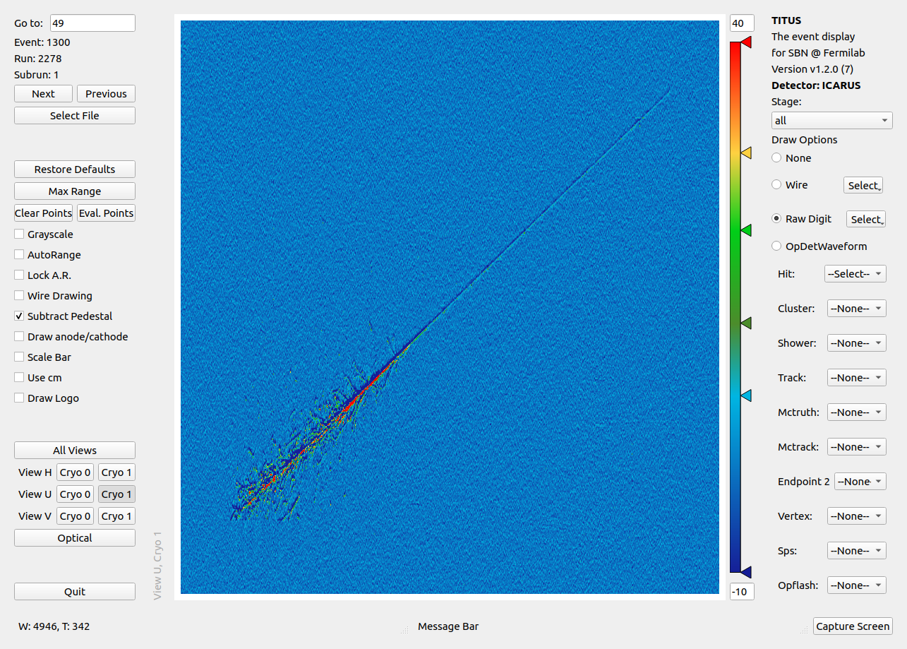

TITUS Event Display
===================

How to Run TITUS on a gpvm machine
----------------------------------

- Note that it is best to use a VNC connection to run TITUS remotely, see the instructions to set that up [here](https://cdcvs.fnal.gov/redmine/projects/sbndcode/wiki/Viewing_events_remotely_with_VNC "by Dom Brailsford")
- Log into a gpvm machine (note: if using VNC make sure the machine you have enabled as above)
- Navigate to `/icarus/app/TITUS`
- source the setup file (`setup_TITUS.sh`)
- Launch the event display with the command `evd.py -i /path/to/your/decoded/file`

Notes
-----

- Find data files at this [link](https://docs.google.com/spreadsheets/d/1nkMDRcguwIuaHFUH6sFDLd3UcQVNrCpe8pLdELHsuAk/edit#gid=41507160)
    - Note that this is a protected link, you will need to request access to view the list of runs
- You can use `samweb` to locate decode files available on PNFS disks:
    - `samweb list-files "run_number=nnnn"`   where `nnnn` is the run number being searched for
    - `samweb locate-file filename`   where filename is a decoded file
- When the display initially opens no drawing objects will have been selected, in the display select "Raw Digit" in the right column to display waveforms.
